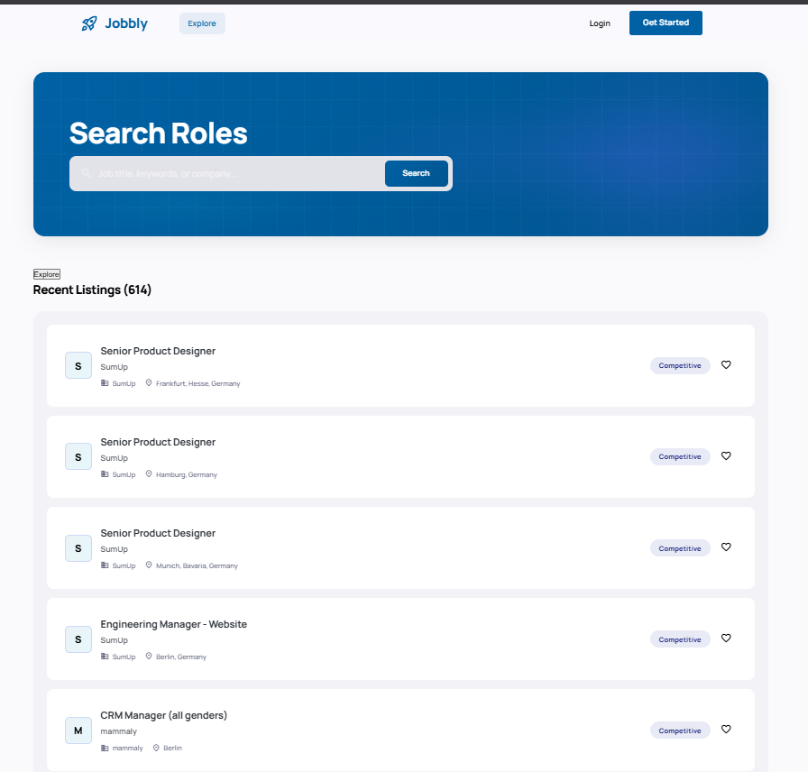
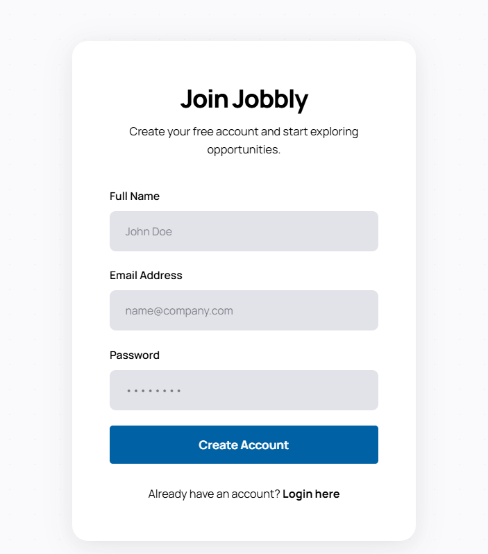
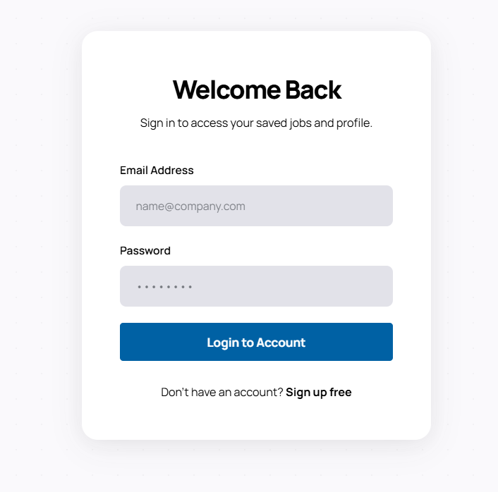
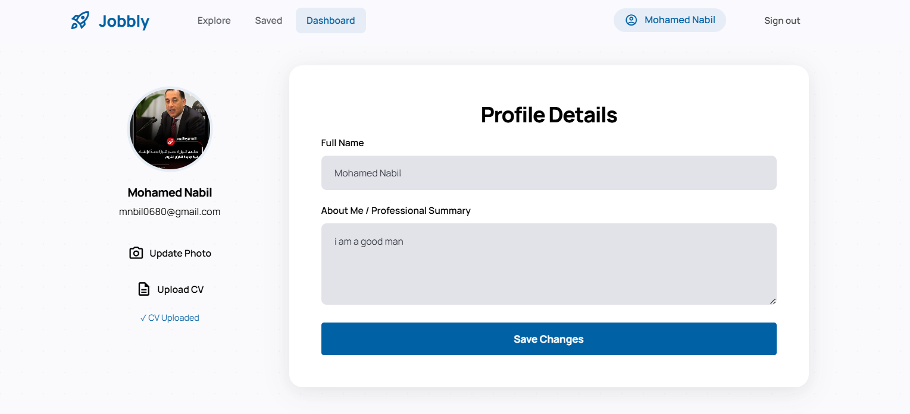
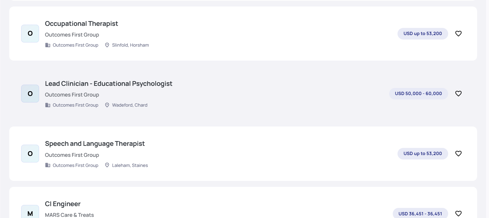
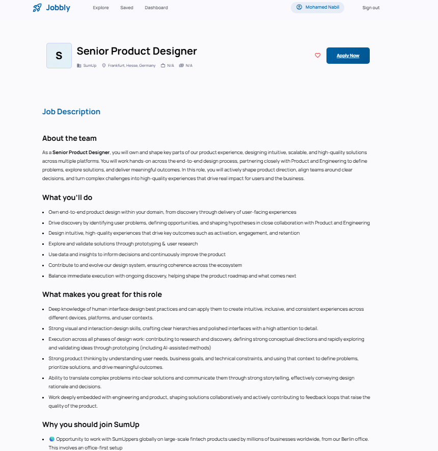
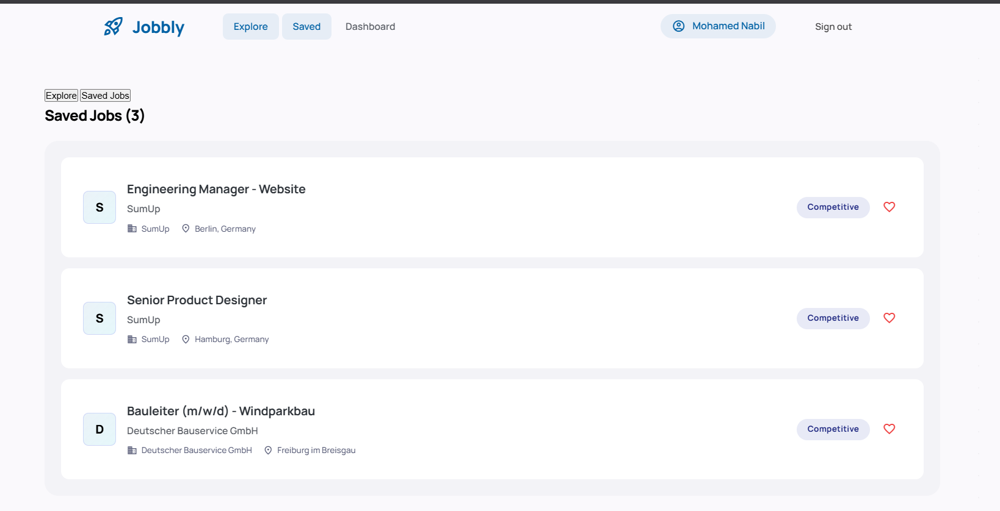
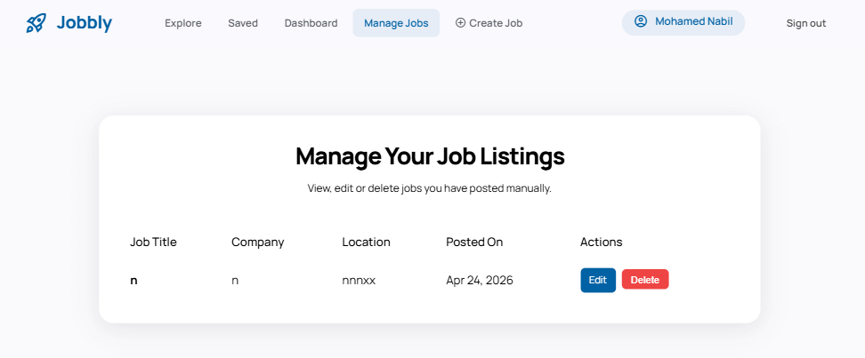
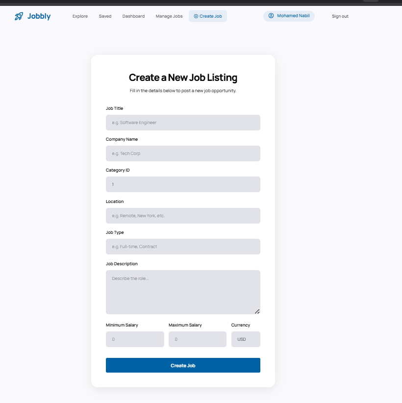

# Jobbly - Job Application Manager



## Table of Contents
- [Description](#description)
- [Screenshots](#screenshots)
- [Features](#features)
- [Technologies Used](#technologies-used)
- [Prerequisites](#prerequisites)
- [Installation and Setup](#installation-and-setup)
- [Running the Application](#running-the-application)
- [Project Structure](#project-structure)
- [Documentation](#documentation)
- [License](#license)
- [Authors](#authors)

## Description
Jobbly is a premium, editorial-grade Single-Page Application (SPA) that helps users search, track, and manage their job applications from multiple job sources in one place. It provides a robust and visually stunning interface to find jobs, save them, manage your own postings, and much more.

## Screenshots

### Home Page


### Sign Up & Login



### User Profile


### Job Exploration



### Job Management




## Features
- **Modern SPA Architecture:** Seamless transitions, fast loading, and dynamic content updates without full page reloads.
- **Premium Design:** Glassmorphism, tonal depth, and custom typography provide a visually stunning experience.
- **User Authentication:** Secure sign-up, login, and user profile functionality.
- **Job Fetching & Ingestion:** Pulls thousands of jobs from multiple API sources (Remotive, Jobicy, RemoteOK, etc.) using a dedicated CLI tool.
- **Job Management:** 
  - Save favorite jobs.
  - Create and post your own jobs.
  - Manage (Edit/Delete) the jobs you posted.
- **Advanced Search & Pagination:** Server-side pagination and robust search functionalities for seamless browsing.

## Technologies Used
- **Backend:** PHP 8.2+
- **Database:** MySQL
- **Frontend:** HTML5, Vanilla CSS (Custom styling, modern layouts), Vanilla JavaScript, AJAX (Fetch API)
- **Job Sources:** 15 different APIs for job aggregation

## Prerequisites
To run this project locally, we recommend using **XAMPP** (or WAMP/MAMP) to provide the necessary PHP and MySQL environment.
- **XAMPP** (with PHP 8.2+)
- **MySQL** (Included in XAMPP)
- **Git**

## Installation and Setup

### 1. Clone the Repository
Clone the repository into your XAMPP `htdocs` folder (e.g., `C:\xampp\htdocs\jobbly`).
```bash
cd C:\xampp\htdocs
git clone <repository_url> jobbly
cd jobbly
```

### 2. Configure Database
1. Open the XAMPP Control Panel and start **Apache** and **MySQL**.
2. Go to `http://localhost/phpmyadmin/` in your browser.
3. Create a new database named `jobbly`.
4. Run the database setup or import your schema if required.

### 3. Setup Configuration
Copy the example configuration file and configure your database credentials and API keys:
```bash
cp config/config.example.php config/config.php
```
Edit `config/config.php` to set your MySQL username/password and any necessary API keys.

## Running the Application

### Accessing the Web App
Simply open your browser and navigate to:
```
http://localhost/jobbly
```

### Ingesting Jobs via CLI (Recommended)
To populate the database with jobs from our 15 sources, we strongly recommend using the provided ingestion script. Open your terminal in the project root and run:
```bash
php src/ingest_jobs_cli.php
```
*This command fetches live jobs from various providers and stores them in your local database for rapid searching and pagination on the frontend.*

## Project Structure
```text
jobbly/
├── app/               # Main Application (Views, Controllers, Assets)
├── bin/               # Executable startup scripts
├── config/            # Configuration files (DB, APIs)
├── docs/              # Comprehensive Documentation
├── pics/              # Screenshots for Documentation
├── scripts/           # Utility and setup verification scripts
└── src/               # Job Fetcher System & Ingestion CLI
```

## Documentation
For more in-depth technical details, check the `docs/` folder:
- `docs/START_HERE.md` - Read this first!
- `docs/SETUP_GUIDE.md` - Master documentation
- `docs/FETCHER_IMPLEMENTATION.md` - Technical architecture

## License
[Add your license here]

## Authors
- Backend: AI Assistant (OpenCode)
- Project Lead: [Your Name]
